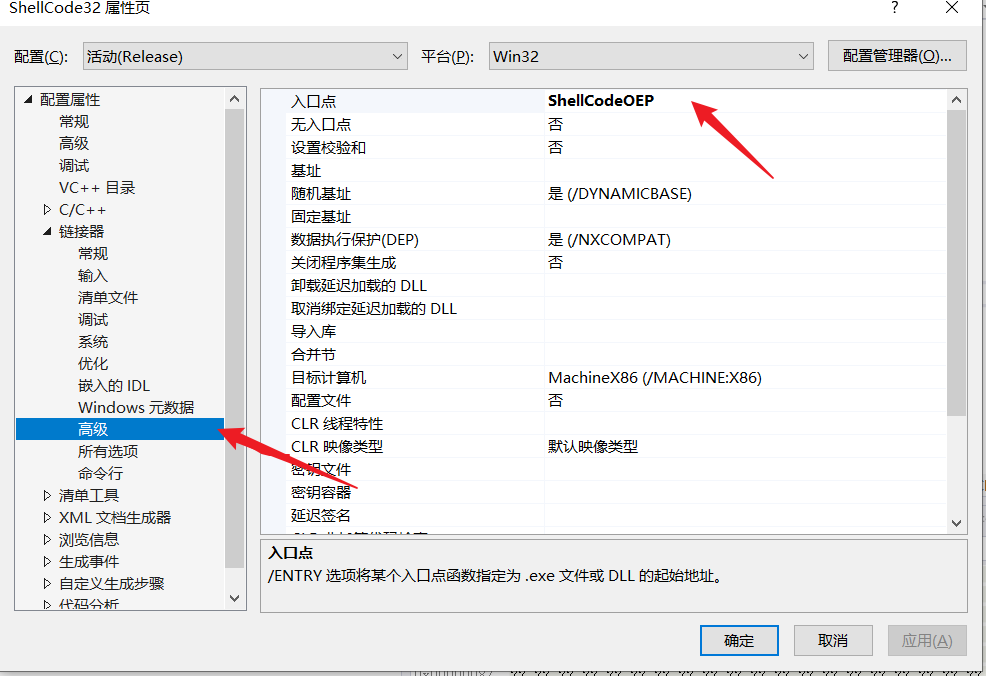
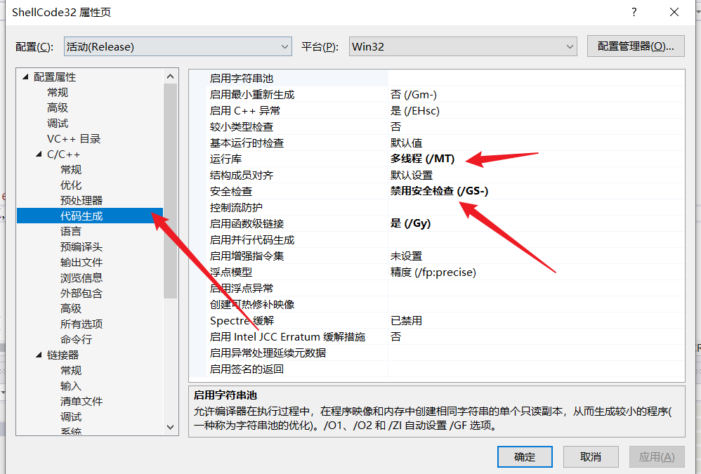
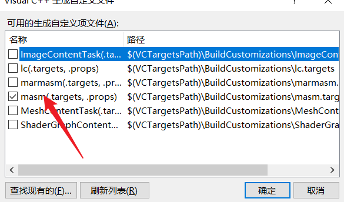
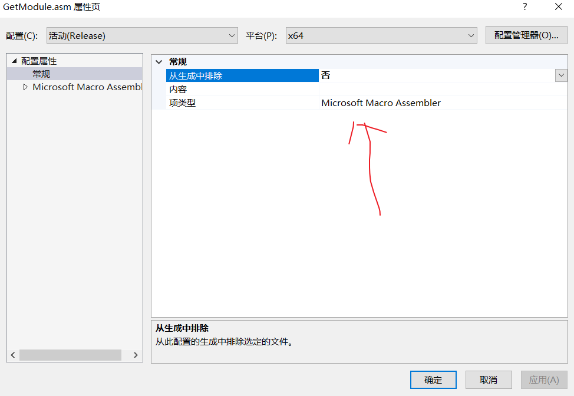

# CppDevShellcode


## 前言：

网络上推荐开发shellcode是用Clang、或者python开发，有些博客直接用的汇编在写。

为了简化开发的难度，并且windows上还是主推Visual Studio写cpp。

所以就有了这个使用Visual Studio开发shellcode的项目。

**开发基础：cpp、win32编程、pe结构、x64/x32汇编**


## 0x01 开发环境配置

1. 保证随机基址开启（VS默认开启随机基址）
2. Debug改成Release模式 （测试的时候也可以用debug，最后生成的时候改成Release就行）
3. 修改入口函数（不能使用默认的main函数，vs在调用main函数之前做了很多处理导致代码会出现**绝对地址**）
4. 关闭GS选项
5. 关闭优化
6. 使用静态库

### 图文

1）修改入口函数(32位)



2）关闭gs



3）关闭优化，调成静态库


### 64位环境配置

由于微软不给在64位cpp代码中插入汇编指令，并且所有调用约定都是FASTCALL。需要使用联合编译汇编才行

1. 新建一个name.asm文件（文件名不能和项目名一样）
2. 项目属性-》生成依赖项-》生成自定义 ----》吧masm选项勾上
3. 右键asm文件属性-》项目类型选择asm

图文：

1）项目生成依赖项



2）asm属性



-----------------------


## 0x02 拿kernel32模块基址

fs寄存器中保存了tep和peb的地址，

peb中保存了ldr结构体

```
HMODULE GetKernel32Base()
{
	
	HMODULE hKer32 = NULL;
	__asm
	{
		mov eax, fs: [0x18] ; //TEB
		mov eax, [eax + 0x30]; //PEB
		mov eax, [eax + 0x0C];//_PEB_LDR_DATA
		mov eax, [eax + 0x0C];  // _LIST_ENTRY 主模块
		mov eax, [eax]
		mov eax, [eax]
		mov eax, dword ptr[eax + 0x18];// KERNEL32基址
		mov hKer32, eax

	}
	return hKer32;
}
```


## 0x03 自己实现GetProcAddress函数

自己实现GetProcAddress函数，去获取kernel32中的 LoadLibraryA 、GetProcAddress等函数地址

获取到函数地址之后转成函数指针调用。

原理：

	1. 拿到kernel模块基址就是MZ的地址
	1. 解析pe文件格式
	1. 定位导出表
	1. 找到指定导出表中函数名称
	1. 再去拿指定函数的地址，并且返回

这里就不贴代码了，由于是自己实现的函数下文统称MyGetProcAddress。

**注意：需要解析pe文件所以64位的和32位的MyGetProcAddress不通用。**


## 0x04 保存函数地址

shellcode开发不能有绝对地址也就不能使用全局变量，所以需要一个结构体来保存函数指针。

函数调用的时候专递结构体指针就能拿到函数地址。

这里就新建一个头文件，把结构体和函数声明都放到这个头文件里面去

```hpp
//windowsapi 函数指针声明
typedef int (WINAPI* PFN_MessageBoxA)(HWND, LPCSTR, LPCSTR, UINT);
typedef HMODULE(WINAPI* PFN_LoadLibraryA)(LPCSTR);
typedef FARPROC(WINAPI* PFN_GetProcAddress)(HMODULE, LPCSTR);

//存函数地址的结构体
typedef	struct SellcodeEvn
{
	PFN_MessageBoxA m_pfnMessageBoxA;
	PFN_LoadLibraryA m_pfnLoadLibraryA;
	PFN_GetProcAddress m_pfnGetProcAddress;


}SCENV, * PSCENV;

//函数的声明
EXTERN_C HMODULE GetModuleKernel();
FARPROC MyGetProcAddress(HMODULE hModule, char* lpProcName);
```


## 0x05 拿api函数地址

1)MyGetProcAddress函数第一个参数是模块基址，第二个参数是函数名。

2）**不能有char*类型的变量**（否则会被放到数据区，产生绝对地址）


```
void InitEnv(PSCENV pEnv)
{
	char sz_MessageBoxA[] = { 'M','e','s','s','a','g','e','B','o','x','A','\0' };
	char sz_LoadLibraryA[] = { 'L','o','a','d','L','i','b','r','a','r','y','A','\0' };
	char sz_GetProcAddress[] = { 'G','e','t','P','r','o','c','A','d','d','r','e','s','s','\0' };
	char sz_user32[] = { 'u','s','e','r','3','2','\0' };

	//拿kernel32的地址
	HMODULE hKernel32 = GetModuleKernel();
	pEnv->m_pfnGetProcAddress = (PFN_GetProcAddress)MyGetProcAddress(hKernel32, sz_GetProcAddress);
	pEnv->m_pfnLoadLibraryA = (PFN_LoadLibraryA)pEnv->m_pfnGetProcAddress(hKernel32, sz_LoadLibraryA);
	
	HMODULE hUser32 = pEnv->m_pfnLoadLibraryA(sz_user32);
	pEnv->m_pfnMessageBoxA = (PFN_MessageBoxA)pEnv->m_pfnGetProcAddress(hUser32, sz_MessageBoxA);
}
```

PS：自己开发一个char* 转char数组的工具，以及api函数转函数指针。 **或者让GPT给你转也行。**


## 0x06 入口点调用函数完成自己的功能

入口函数之前不能放别的函数。第一个函数只能是入口函数。

```
//这是shellcode的入口函数
void ShellCodeOEP()
{
	SCENV env; //存放函数地址的结构体
	InitEnv(&env); //给结构体赋值函数地址

	//测试代码messageboxa
	char sz_hello[] = { 'h','e','l','l','o','\0' };
	env.m_pfnMessageBoxA(NULL, sz_hello, sz_hello, MB_OK);
	//代码从这开始写


}
```

这里只做了一个messageboxa，需要什么功能照着模板写就是了 。

也可以先生成DEBUG版本的调试一下，无错误再生成Release版本。

用2进制编辑器打开生成的pe文件，拷贝.text节区的所有内容即可完成shellcode制作。

2进制编辑器 010Editor、winhex都行。


## 0x07 64位--汇编拿kernel32基址

需要联合编译，拿基址的汇编代码只能单独写到.asm  文件里面。联合编译在头文件里面定义函数声明调用。


shellcode.asm

```asm
.code
GetModuleKernel proc
	xor r8, r8
	xor rax, rax
	xor r10, r10
	add r10, 60h
	mov rax, gs:[r10]     ;通过GS寄存器获取PEB基址
	mov rax, [rax + 18h]  ;获取PEB中Ldr数据结构的基址
	mov rax, [rax + 10h]  ;获取Ldr数据结构的InmemoryOrderModuleList字段的基址
	mov rax, [rax]		   ;获取InmemoryOrderModuleList链表第一个节点 用这个取就是ntdll的基址
	mov rax, [rax]		   ;获取InmemoryOrderModuleList链表第一个节点  用这个就是kernen32的基址
	mov rax, [rax + 30h]  ;获取节点中BaseAddress字段，既kernel32.dll的基址
	ret
GetModuleKernel endp
end
```


## 结语

有几个开发的注意事项。

* 声明变量不要给初始值。
* 入口函数在第一个。否则oep会在shellcode中间。
* 存api函数地址不能使用全局变量，可以定义一个结构体来存放。
* MyGetProcAddress 由于要解析pe头，所以32位和64位不通用。
* strcmp、memcpy这种函数得自己实现， 可以去vc++6.0 里面拷贝。

生成完shellcode之后吧可执行文件丢到x64dbg里面去，f9运行到OEP往下翻一下，看看地址下面有没有横线。

出现横线就代表代码中出现了绝对地址的变量。

右键在内存窗口中转到，结合pdb符号文件找出哪个函数中出现的绝对地址。


## 特别鸣谢：

wangda:https://github.com/wangda38

此项目参照好兄弟提供的upx壳代码shellcode部分二开。

